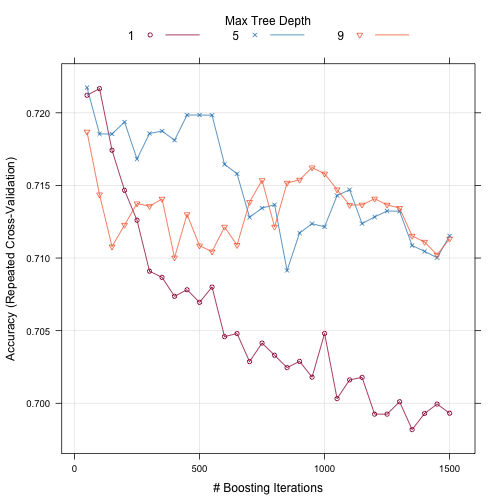
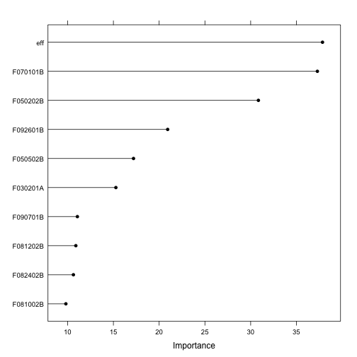
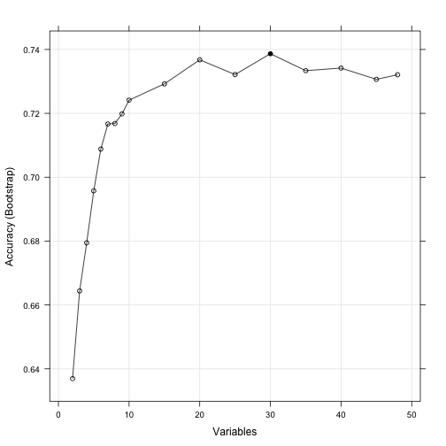

## Abstract

## introduction

Business failure prediction is crutial for investors, stock holders, managers, employees and government officials, and thus has been an hot topic in academic studies. 

Many technical methods have been applied to predict business failure. Amoung which are XX categories: XX, XX, XX, and XX.
XX(author) made an thorough review on XX. 

## Literature Review

### Data Envelopment Aanaysis(DEA)

DEA is a nonparametric method proposed by Charnes, Cooper and Rhodes in 1978. it has been applied to many fileds Because of its many advantages: it does not require any assumptions to be made about the distribution of inefficiency and it does not require a particular functional
form on the data in determining the froniter. it is capable of being used with any input-output measurement, and capable of handling multiple inputs and outputs. The CCR model requires inputs and outputs to be positive, which may be not applied in real life. for example, profits as an output may be negative. In this paper, we will introduce a modified SBM model (Tone 2004，Düzakin,E.,Düzakin,Hatice,2007) to tackle this problem. The SBM model is as follows:


$$
    \begin{aligned}
    \min & \rho=\frac{1-(1/m)\sum_{i=1}^{m}s_{i}^{-}/x_{io}}{1+(1/s)\sum_{r=1}^{s}s_{r}^{+}/y_{ro}}\\
    \textrm{s.t.} & \mathbf{x_{o}}=\mathbf{X\lambda}+\mathbf{s^{-}}\\
     & \mathbf{y_{o}}=\mathbf{Y\lambda}+\mathbf{s^{+}}\\
     & \mathbf{\lambda}\geq\mathbf{0},\mathbf{s^{-}}\geq\mathbf{0},\mathbf{s^{+}}\geq\mathbf{0}
    \end{aligned}
$$

However, this model can not handle negative output.（Tone 2004，Düzakin,E.,Düzakin,Hatice,2007）proposed an solution to this problem. Assuming $y_{ro}<0$, following transformations were applied:

$$
\begin{aligned}
\overline{y}_{r}^{+} & =\textrm{Max}_{j=1,2,...n.}\{y_{rj}|y_{rj}>0\}\\
\underline{y}_{r}^{-} & =\textrm{Min}_{j=1,2,...n.}\{y_{rj}|y_{rj}>0\}
\end{aligned}
$$

The term $s_r^+/y_{ro}$ in the objective function as replaced as follows：if $y_{ro}<0$ ,and $\overline{y}_{r}^{+}>\underline{y}_{r}^{+}$,then it will be replaced with

$$
s_r^{+}/\frac{\underline{y}_{r}^{+}(\overline{y}_{r}^{+}-\underline{y}_{r}^{+})}{\overline{y}_{r}^{+}-y_{ro}}
$$

Note that the term $y_{ro}$ are not replaced in the constraint. 

After transformation, all negaitve output were transformed to be positive and strictly less than $\underline{y}_{r}^{+}$ . and the more negative an output is,  the less its tranformation value.


### Random Forest

Random forest, developed by Leo Breiman(1) and Adele Cutler(2), is an ensemble learning method for classification and regression that operate by constructing a multitude of decision trees. For a given training dataset, $A = {(X_1,y_1),(X_2,y_2),\cdots,(X_n,y_n)}$,Where $X_i = 1,2,\cdots,n$, is a variable or vector and $y_i$ is its corresponding property or class label; the basic RF algorithm is presented as follows:

#### Bootstrap sample. 

Each training set is drawn with replacement from the original
dataset A. Bootstrapping allows replacement, so that some of the samples will be repeated
in the sample, while others will be “left out” of the sample. The “left out” samples
constitute the “Out-of bag (OOB)” which has, for example, one-third, of samples in A which are used later to get a running unbiased estimate of the classification error as trees
are added to the forest and variable imp ortance


#### Growing trees.

For each bootstrap sample, a tree is grown m variables $(m_{try})$ are
selected at random from all n variables $(m_{try} \leq n)$ and the best split of all $(m_{try})$ is used at
each node. Each tree is grown to the largest extent (until no further splitting is possible)
and no pruning of the trees occurs.

#### OOB error estimate. 

Each tree is constructed on the bootstrap sample. The OOB
samples are not used and therefore regarded as a test set to provide an unbiased estimate
of the prediction accuracy. Each OOB sample is put down the constructed trees to get
a classification. A test set classification is formed. At the end of the run, take k to be
the class which got most of the “votes” every time sample n was OOB. The proportion of
times that k is not the true class of n averaged over all samples is the OOB error estimate.

### SVM

Support vector machines(SVM) is the theory based on statistical learning theory. It realizes the theory of VC dimension and principle of structural risk minimum(SRM). The idea of SVM is to search an optimal hyper-plane :TODO:

Suppose we are given a set of training data $xi \in R^n(i=1,2,…,n)$ with the desired output $yi∈{+1,-1}$ corresponding to the two classes. And suppose the dataset is linear seperable. So there exists a separating hyper plane with the target functions w·xi+b=0 (w represents the weight vector and b represents the bias). To ensure that all training data can be classified, we must make the margin of separation $(2/‖w‖)$ maximum. Then, in the case of linear separation, the linear SVM for optimal separating hyper plane has the following optimization problem.

$$
\begin{aligned}\max & \frac{2}{||w||}\\
\text{s.t.} & y^{(i)}(w^{T}x^{(i)}+b)\geq1,i=1,\cdots,n\\
\end{aligned}
$$

the model above can be transformed as:

$$
\begin{aligned}\min & \frac{1}{2}||w||^{2}\\
\text{s.t.} & y^{(i)}(w^{T}x^{(i)}+b)\geq1,i=1,\cdots,n
\end{aligned}
$$


## Results and Discussion


### The data

Our aim is to predict whether a company would experience financial failure in two years after based on the financial statement data of current year. The data are from XXXX. We collected data from 2004 to 2013 but only use  2004-2010 for prediction.  for example, we obtain data of a company in its 2010 financial statement and this company was classifed as special treatment(ST*) in 2013 for the first time. we pair the data in 2010 and the label ST in 2013 together to build our model. Once the model was built, we can predict wether a specific company will be classified as special treatment two years after.

### procedure
First, we calculate DEA efficiency of the corperations in each year, and use the efficiency as a feature.  Second, we caluclate viarable importance through random forests. third, we build our models using the 5 most important variables. When building our models, we randmonly select 200 nonST corperatons and resample ST corperations to 200 to make the two classes (i.e. ST and Non-ST) balance. forth, we randomly divide the 400 sample into training set and testing set.
fifth, we use the training set to train different models. sixth, we compared these models.

### results

The results shows that efficiency is an important factor in predicting ST.


```
## 
## Attaching package: 'dplyr'
## 
## The following objects are masked from 'package:plyr':
## 
##     arrange, count, desc, failwith, id, mutate, rename, summarise,
##     summarize
## 
## The following object is masked from 'package:stats':
## 
##     filter
## 
## The following objects are masked from 'package:base':
## 
##     intersect, setdiff, setequal, union
```


T-test was performed to test whether the average efficiencies of the two classes were different. The results showed that in each year, the average efficiencies were different in the two groups. The average efficiencies of Non-ST corporations were greater than those of ST corportations, which indictated that efficiencies did affect whether a corporation would be classified ST.


```
##   year         t       df mean in group NO mean in group YES      p.value
## 1 2004  6.289462 79.48763        0.1867667        0.06452167 1.614410e-08
## 2 2005  9.104105 46.25286        0.1641083        0.04398829 7.014893e-12
## 3 2006  2.419709 27.69179        0.1779674        0.08574585 2.235514e-02
## 4 2007  2.995092 61.91787        0.1357489        0.06027207 3.941019e-03
## 5 2008  8.257729 21.22337        0.1393429        0.02695048 4.556909e-08
## 6 2009 16.951634 79.10053        0.1698880        0.01851906 4.660759e-28
## 7 2010  7.926714 25.88826        0.1705648        0.02631009 2.166611e-08
```

Together with efficiency, there are other 47 finacial ratios in our data sets. However, not all of the variables are useful for predicting. To reduce model complexity, we used random forest to select the variables that has the most importance. First, all the ST corporations are selected, and the same size of Non-ST corporations are randomly sampled from Non-ST group. Then based on the selected data, feature importances will be calculated using the rfe function in the caret package. Because the Non-ST data was randomly sampled, feature importances maybe different according to different Non-ST data. In viewing of this, the feature selection was performed 20 times, variables that appears in all the 20 times and in top 5 of each time would be eligible to be chosen. Finally we got 4 variables: eff, F070101B, F092601B, F050202B.


```
## Loading required package: lattice
## Loading required package: ggplot2
## Loading required package: gbm
## Loading required package: survival
## Loading required package: splines
## 
## Attaching package: 'survival'
## 
## The following object is masked from 'package:caret':
## 
##     cluster
## 
## Loading required package: parallel
## Loaded gbm 2.1
```

  


```
## Loading required package: foreach
## foreach: simple, scalable parallel programming from Revolution Analytics
## Use Revolution R for scalability, fault tolerance and more.
## http://www.revolutionanalytics.com
## Loading required package: iterators
## randomForest 4.6-10
## Type rfNews() to see new features/changes/bug fixes.
```

 


It is shown that every variable do contribute to the predition accuracy, and DEA efficiency rank the 6th. for simplicity, we choose the first 3, 5, 10 most important variables, explore the difference of accuracy using a variaty of machine learning methods. 


```
##      method Accuracy_without_eff Accuracy_with_eff
## 1 svmLinear            0.6357143         0.7071429
## 2        rf            0.6571429         0.6857143
## 3        nb            0.7142857         0.7428571
## 4      C5.0            0.7571429         0.7714286
## 5       gbm            0.7428571         0.7500000
## 6       glm            0.6857143         0.7071429
## 7  multinom            0.6857143         0.7071429
```


From the figure XX,we can see that the importance of variable **efficiency** is not that great.


## Conclusion


## Reference
1.  Breiman, Leo (2001). "Random Forests". Machine Learning 45 (1): 5–32. doi:10.1023/A:1010933404324.

2. 
